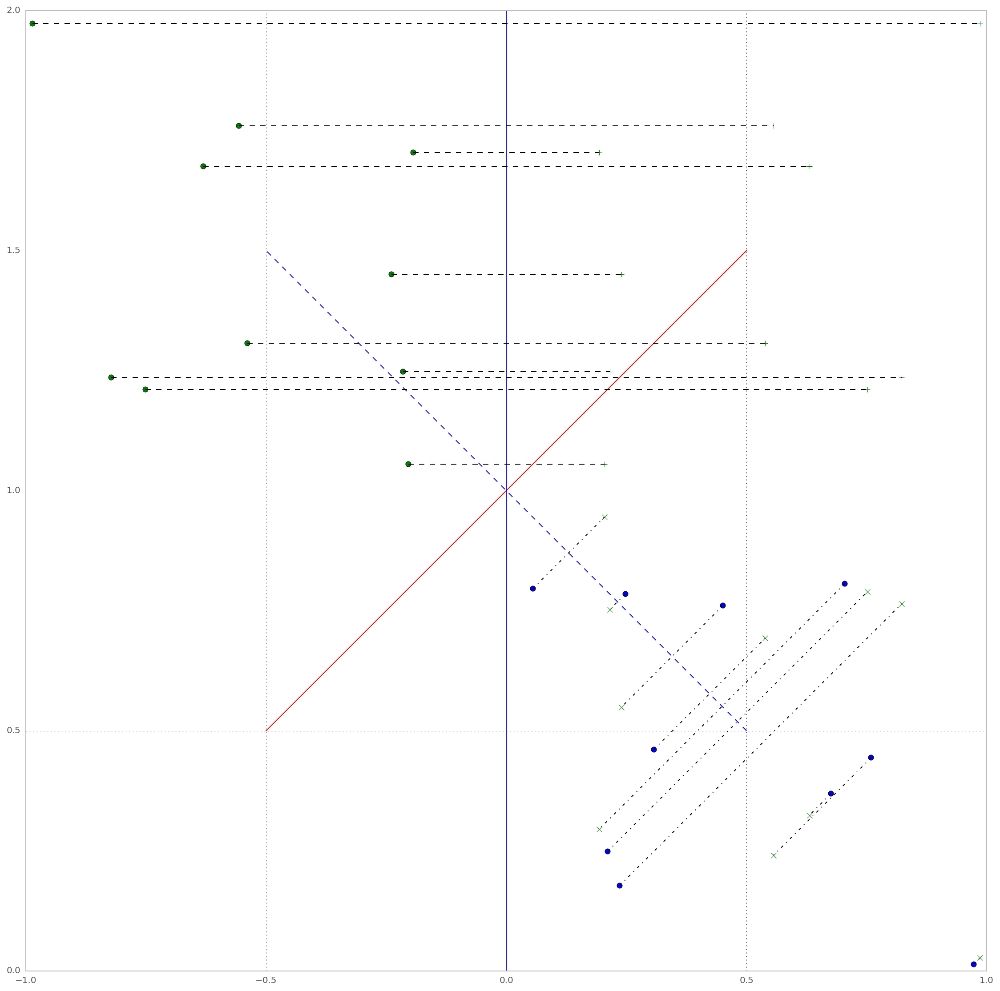

# elasticite

geom https://github.com/laurentperrinet/elasticite/blob/master/posts/2015-11-27%20%C3%A9lasticit%C3%A9%2C%20geometrie.ipynb)

crabe https://github.com/laurentperrinet/elasticite/blob/master/posts/2015-11-02%20%C3%A9lasticit%C3%A9%20expansion%20en%20miroir%20-%20exploration%20param%C3%A8tres.ipynb

onde https://github.com/laurentperrinet/elasticite/blob/master/posts/2015-11-29%20%C3%A9lasticit%C3%A9%20-%20sc%C3%A9nario%20onde.ipynb

master https://github.com/laurentperrinet/elasticite/blob/master/posts/2015-12-05%20%C3%A9lasticit%C3%A9%20-%20sc%C3%A9nario%20final%20montage.ipynb

